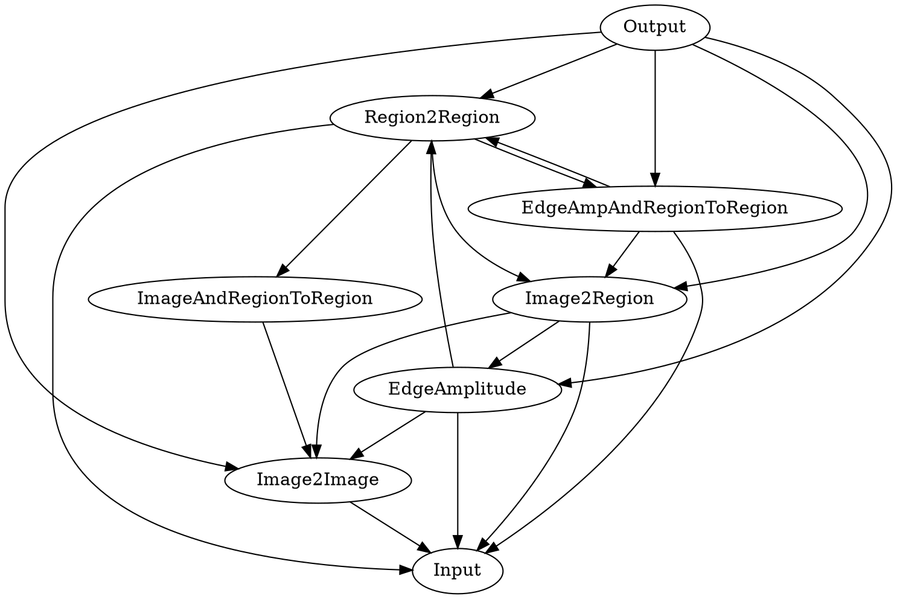

# Experiments

This repository contains all scripts that were designed to analyze data from image processing using the cartesian genetic programming implementation in https://gitlab.cc-asp.fraunhofer.de/opm/evias/optimization.

## Repository Overview
* identify_rovings_aircarbon: `datapreparation\python\identify_roving.py`
* json_to_binary: `datapreparation\python\json_to_binary.py`
* import_many: `api\main.py`
* crop_to_tiles: `datapreparation\python\crop_to_tiles.py`
* crop_to_tile Blende5: `datapreparation\python\crop_to_tiles.py C:\Users\mara_c10\Desktop\2022_CGP_Experimente\Owncloud_AirCarbon3\Annotation\AirCarbon2\160919_SGL\Blende5_6_1800mA C:\Users\mara_c10\Desktop\2022_CGP_Experimente\Owncloud_AirCarbon3\Annotation\AirCarbon2\160919_SGL\Blende5_6_1800mA_rov 140`
* Dashboard: `dashboard\dashboard.py`

## Contents

1. <a href="#setup-and-usage">API Basics for experimental data / Plotting data [ACSOS 2023]</a>
1. <a href="#follow-up-optimization-using-sa--ls">Dissertation 2024: Optimization using SA / LS Algorithms [Dissertation 2024]</a>
1. <a href="#complexity-analysis">Complexity Analysis of CGP Pipelines [Dissertation 2024]</a>
1. <a href="#pipeline-retrieval">Pipeline Retrieval [Arxiv 2025]</a>
1. <a href="#free-dependencies">Benchmark Experiment with Open Graph (classic CGP-IP)</a>
1. <a href="#random-search">Random Search on HDev</a>

## Setup and Usage

### Quick Start

1. Set up a python environment using `python -m venv <PATH>\venv`, then activate environment by `venv\Scripts\activate.bat`
1. Install requirements: `python -m pip install -r requirements.txt`
1. Execute `main.py` by `python main.py`

### Run Scripts

The repository contains the following function to process experimental data:

#### API

* `experiments\api` contains a database wrapper for SQLite written with `SQLAlquemy`
* it can be used to **import** data from `CGP optimization` and analyze them as follows
  * `python api\main.py --importmany "<PATH>\test_api\many_results_dir"`
  * `python api\main.py --importone "<PATH>\test_api\one_result_dir"`
* database is stored (or created if it doesn not exist) in: `<PATH>\api\experiments.db`
* For more details on how to use the database api, see: [api/Readme.md](api/Readme.md)

#### Data Dashboards and Plotting

* `main.py` runs the main analysis and plotting scripts and contains a text-based user menu
* Run it as follows:
  * `python -m main.py`
* Select entries of the following manu by typing the related number:
  * `1 -- Create plots of complexity and fitness for every evias datasets`
  * `2 -- Read DB and create 1 plot with all fitness values`
  * `3 -- Read DB and create one plot for each dataset`
  * `4 -- Generate HTML reports`
  * `5 -- Print Dashboard Plots`
  * `6 -- Print Sample Plots`
  * `7 -- Create ACSOS Plot`
  * `8 -- Follow Up Optimization using SA / LS`
  * `8 -- Plot Missing SA/LS and CGP Evolutions`
  * `10 -- Plot CGP Insights`
  * `0 -- EXIT`

#### Guide to Script Outputs

* `1 -- Create plots of complexity and fitness for every evias datasets`
  * Writes plot to: `report\...`
* `2 -- Read DB and create 1 plot with all fitness values`
* `3 -- Read DB and create one plot for each dataset`
* `4 -- Generate HTML reports`
  * Creates an HTML overview on all results in `api\experiments.db`
  * Writes it to: `report\results.html`
* `5 -- Print Dashboard Plots`
* `6 -- Print Sample Plots`
  * Contains scripts to create sample plots
  * using `matplotlib`
* `7 -- Create ACSOS Plot`
  * Creates fitness plots used for the ACSOS 2023 paper
  * Script is located in: `dashboard\acsos_plots.py`
  * It reads static values from: `dashboard\acsos_vars.py`
  * Writes it to: `scripts\report\*.png`
* `8 -- Follow Up Optimization using SA / LS`
  * Runs follow-up parameter tuning with additional algorithms
  * See section `Follow-Up Optimization`
* `9 -- Plot Missing SA/LS and CGP Evolutions`
  * creates plot of transistor and roadcracks cgp fitness progress
  * computes sa/ls for the same pipelines (transistor and roadcracks)
* `10 -- Plot CGP Insights`
  * Read from `test\cgp_insights` logs for missing_cable and tile_cracks
  * creates dot pipeline charts for generations with a fitness increase
  * writes it to `test\cgp_insights_out`
* `0 -- EXIT`

### Follow Up Optimization using SA / LS
* Further experiments were conducted on selected pipelines generated by CGP
* For that purpose, a pipeline with a fitness closest to the mean fitness for each dataset was selected
* The pipeline was run in MVTec HALCON to evaluate the result
* Two algorithms were then applied to tune the operator parameters, but NOT change the order of operators:
  * Simmulated annealing (SA)
  * Local search (LS)

#### Guide to Script Menu
* The LS/SA algorithm can be run using a sub menu (8 - Follow Up ...) which shows the following menu:
* OR run: 
  * `python -m param_tuning/run_param_tuning.py`
* This will show the following menu:
  * `FOLLOW UP OPTIMIZATION using SA /LS`
  * `1 -- MANUAL 1: Export digraphs to txt`
  * `2 -- MANUAL 2: Read manual HDEV files and perform SA/LS`
  * `3 -- AUTOMATIC: Read DB and apply HDEV optimization`
  * `4 -- Plot results in bar charts`
  * `0 -- EXIT`
* 1: Extracts pipelines from DB (`linked_list_of_mean_fitness_and_digraph`) and writes digraphs to `param_tuning\digraph_mean\*.txt`
* 2: Reads hdev files from `param_tuning\hdev_manual` and runs LS and SA
  * before running no. 2, all txt-based digraph files have to be manually translated to executable hdev files
  * also, for each hdev file, a python function has to be created to run the parameter tuning
* 3: (_NOT TESTED/FULLY IMPLEMENTED_) Automatically Reads from DB and writes pipelines to hdev (`param_tuning\hdev`)
* 4: Reads LS/SA results from txt files (`param_tuning\hdev_manual\*.txt`) and creates bar charts
### CGP configuration

- ES(1 + 4) recommended as the most efficient configuration, therefore will not be changed
- input and output is usually 1 image
- levels back `l` usually 1, but not as much applicable due to the dependency graph
- termination reached at 150 generations

| Parameter            | Value           |
|----------------------|-----------------|
| ES(&#956; + &#955;)  | ES(1 + 4)       |
| Mutation rate        | -              |
| Termination          | 150 generations |
| `n`<sub>r</sub>      | 10              |
| `n`<sub>c</sub>      | 10              |
| `n`<sub>i</sub>      | 1               |
| `n`<sub>o</sub>      | 1               |
| `l`                  | 1               |
| `n`<sub>f</sub>      | ?               |

## Complexity Analysis

In general, the following formula allows to compute the entropy or information density of an image:

`$- \sum_{i=0}^{n=1} p_{i} log_{b} p_{i}$`

`where n is the number of gray levels (256 for 8-bit images), p_{i} is the probability of a pixel having gray level i, and b is the base of the logarithm function.`

Also see: https://stackoverflow.com/questions/50313114/what-is-the-entropy-of-an-image-and-how-is-it-calculated

Metrics selected for complexity analysis:
* Entropy: as defined by the shannon entropy
* Blurriness
* Brightness
* Img Size: size of the image in pixels `W x H`
* lbl Size: size of the label's contained pixels
* label_count_per_image: no. of labels per image
* relative_label_size: size of label in px compared to image
* hist_entropy: ?
* jpeg_complexity
* fractal_dimension
* texture_features
* edge_density
* laplacian_variance
* num_superpixels


Correlation between different complexity metrics **of the full image frame** and achieved fitness:

| Metric | Cor(fit, v) |
| ------ | ----------- |
| entropy_arr | 0.2412421767996174|
| blurriness_arr | 0.2762887926996353|
| brightness_arr | 0.2708873690090166|
| image_size | 0.2568331938079588|
| hist_entropy | **0.43440727765649656**|
| jpeg_complexity | **0.3812743862992159** |
| fractal_dimension | 0.22649332946167774|
| texture_features | 0.28321464597815343|
| edge_density | 0.1244109910153665|
| laplacian_variance | 0.05243821001731175|
| num_superpixels | 0.09958786261625971|

Estimation for the whole image:

* `max r_{fit, hist_entropy} = 0.0.434` actual "best" choice, histogram_entropy of the image;
* `max r_{fit, jpeg_complexity} = 0.333` shows a positive correlation between JPEG complexity and fitness.
* `min r_{fit, laplacian_variance} = 0.0524` worst choice, indicating no correlation at all.

Correlation between the same complexity metrics **of the each label** and achieved fitness:

| Metric | Cor(fit, v) |
| ------ | ----------- |
| label_count_per_image | 0.1808766400116384|
| label_size | 0.15095686543906062|
| relative_label_size | 0.053125526798248744|
| lbl_hist_entropy | 0.17735363985009658|
| lbl_fractal_dimension | 0.14932066630947147|
| lbl_texture_features | **0.4111840109022833**|
| lbl_edge_density | **0.32382825397606485**|
| lbl_laplacian_variance | 0.2990078843142231|
| lbl_num_superpixels | **0.36620833983254**|

Estimation for the whole image:

* `max r_{fit, lbl_texture_features} = 0.0.434` actual "best" choice, texture_feature of the labels;
* `max r_{fit, lbl_edge_density} = 0.324` shows a positive correlation between edge density of labels and fitness.
* `max r_{fit, lbl_num_superpixels} = 0.366` shows a positive correlation between number of superpixels in the label and fitness.
* `min r_{fit, relative_label_size} = 0.0531` worst choice, indicating no correlation at all.

## Analyzing Pipelines by Fitness

Extracting best individual fitness per dataset from sqlite database:
```sql
SELECT d.name AS dataset_name, d.source_directory, bif.best_individual_fitness
FROM dataset AS d
JOIN experiment AS e        ON e.dataset_id = d.dataset_id
JOIN run        AS r        ON r.experiment_id = e.experiment_id
JOIN analyzer   AS a        ON a.run_id = r.run_id
JOIN best_individual_fit AS bif ON bif.analyzer_id = a.analyzer_id
ORDER BY bif.best_individual_fitness DESC;
```

Returning only the best individual fitness per dataset:
```sql
SELECT dataset_name,
       source_directory,
       best_individual_fitness,
       analyzer_id
FROM (
    SELECT d.name AS dataset_name,
           d.source_directory,
           bif.best_individual_fitness,
           bif.analyzer_id,
           ROW_NUMBER() OVER (
               PARTITION BY d.dataset_id
               ORDER BY bif.best_individual_fitness DESC
           ) AS rn
    FROM dataset AS d
    JOIN experiment AS e ON e.dataset_id = d.dataset_id
    JOIN run        AS r ON r.experiment_id = e.experiment_id
    JOIN analyzer   AS a ON a.run_id = r.run_id
    JOIN best_individual_fit AS bif ON bif.analyzer_id = a.analyzer_id
)
WHERE rn = 1
ORDER BY best_individual_fitness DESC;
```

Getting the pipeline and fitness close to mean fitness per dataset:
```sql
SELECT dataset_name,
       source_directory,
       best_individual_fitness,
       analyzer_id
FROM (
    SELECT d.name AS dataset_name,
           d.source_directory,
           bif.best_individual_fitness,
           bif.analyzer_id,
           ABS(
             bif.best_individual_fitness -
             AVG(bif.best_individual_fitness) OVER (PARTITION BY d.dataset_id)
           ) AS dist_to_mean,
           ROW_NUMBER() OVER (
               PARTITION BY d.dataset_id
               ORDER BY ABS(
                 bif.best_individual_fitness -
                 AVG(bif.best_individual_fitness) OVER (PARTITION BY d.dataset_id)
               ) ASC
           ) AS rn
    FROM dataset AS d
    JOIN experiment AS e ON e.dataset_id = d.dataset_id
    JOIN run        AS r ON r.experiment_id = e.experiment_id
    JOIN analyzer   AS a ON a.run_id = r.run_id
    JOIN best_individual_fit AS bif ON bif.analyzer_id = a.analyzer_id
)
WHERE rn = 1
ORDER BY dataset_name;
```

Finally, get pipelines with fitness closest to the lowest fitness per dataset:
```sql
SELECT dataset_name,
       source_directory,
       best_individual_fitness,
       analyzer_id
FROM (
    SELECT d.name AS dataset_name,
           d.source_directory,
           bif.best_individual_fitness,
           bif.analyzer_id,
           ROW_NUMBER() OVER (
               PARTITION BY d.dataset_id
               ORDER BY bif.best_individual_fitness ASC
           ) AS rn
    FROM dataset AS d
    JOIN experiment AS e ON e.dataset_id = d.dataset_id
    JOIN run        AS r ON r.experiment_id = e.experiment_id
    JOIN analyzer   AS a ON a.run_id = r.run_id
    JOIN best_individual_fit AS bif ON bif.analyzer_id = a.analyzer_id
)
WHERE rn = 1
ORDER BY best_individual_fitness ASC;
```

How to extract the digraph for a specific individual / analyzer id:
```sql
SELECT individual.individual_id, individual.fitness, pipeline.digraph 
FROM individual, pipeline
WHERE individual.analyzer_id == 270
AND individual.analyzer_id == pipeline.pipeline_id
ORDER BY individual.fitness DESC;
```

Get the analyzer and experiment results:
```sql
SELECT * FROM analyzer, run
WHERE analyzer.analyzer_id == 307
AND analyzer.run_id == run.run_id;
```

## Pipeline Retrieval

- Conduct a similarity comparison between all available image datasets using embeddings.
- Use pipelines previously computed and evolved on specific image datasets.
- Cross-apply these pipelines to all other datasets.
- With approximately 30 datasets, this results in around 900 cross-applications of pipelines.
- Compute the MCC (Matthews Correlation Coefficient) score for each pipeline run.
- Compare the MCC scores to the dataset similarity metrics.
- Test the hypothesis: more similar datasets yield better MCC results when filter pipelines are cross-applied.

### Running Pipeline Retrieval Experiments

* Run the pipeline retrieval script using:
  * `python -m pipeline_retrieval.run_pipeline_retrieval.py`
## Benchmarking Experiment with Open Graph (classic CGP-IP)
* Using an open graph 
* Dot graph:

## Random Search
tbd