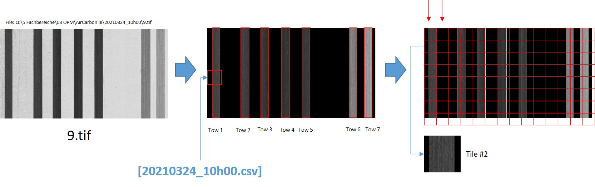

# AirCarbon Data Preparation

## Prepare images for labelling and training 

### Identify rovings in images

In order to reduce the complexity and memory consumption of single large images, we need to identify the roving are and render all background noise black. Doing so not only saves memory space, but also simplifies the annotation procedure.

There are two scripts to find rovings and render background black

* the python script `datapreparation/python/idenfity_roving.py`
* the HALCON script `datapreparation/halcon/identify_roving.hdev`
  
#### The HALCON script

The HALCON folder contains the meta parameters in file `datapreparation/halcon/parameters.conf`:
* `ImageFolder`: the source path from which we read to process image files
* `OFFSET`: defines the margin the script cuts of or adds to each roving (in order to weaken possible overlaps or cutoffs when thresholds are applied)
* `LOW_THRESHOLD`: the lowest binary treshold that will cutoff every "brighter" background which is then considered noise (usually rovings are grayish, black or at least darker then the rest)

The header of the file lists the parameters in the following order:
```
full image directory path (windows encoded)
offset (negative or positive integer)
low threshold (integer between 0 and 255)
```

A sample might look as follows:
```
C:/Users/mara_c10/Desktop/2022_CGP_Experimente/Owncloud_AirCarbon3/Annotation/AirCarbon3/20210325_13h25/
-2
215
```

The parameters in the `hdev` file are named as follows:
```
ImageFolder
OFFSET
LOW_TRESHOLD
```

#### Python Script

The python script can be called using:
```
python datapreparation/identify_roving.py <MY_PATH>/<IMAGE_DIR> <MY_PATH>/<OUTPUT_DIR> TRESHOLD
```
A sample call from the CLI would like like:
```
python datapreparation/identify_roving.py <MY_PATH>\20210325_13h25 <MY_PATH>\20210325_13h25_rov 140
```

### Cropping images into little tiles

We provide a script that divides the large images files (up to 15000 x 7000 in size) into little tiles of size `1024 x 1024`.
Doing so will make it easier for helpers to annotate single images. Ideally, the tiles only show parts of the actual tows that have been scanned using the camera. 

Call the script using:
```
python datapreperation/crop_to_tiles.py <MY_PATH>\20210325_13h25_rov
```

The workflow is as follows:

* Divide image into n tiles of size __1024 x 1024__
* Numbers are running __from top to bottom__
* Only tiles which contain __color/grayscale values__ are stored on drive (i.e. plain black images are skipped for the sake of space saving)
* Store tile in subfolder of running image:
  * if the original image path is: `(...)AirCarbon III\20210324_10h00\9.tif`
  * the tile path would be: `(...)AirCarbon III\20210324_10h00\t_9.tif\2.jpg`
* Store metainfo in csv file __(see below)__ (e. g. `20210324_10h00.csv`)



### Log tile conversion in csv

In order to log the relation between a single tile image to the original large image, we create a log file during conversion.
Given an original large image containing 7 tows named `(...)AirCarbon III\20210324_10h00\9.tif`, the log file will be structured as follows:

* Original File: `(...)AirCarbon III\20210324_10h00\9.tif` 
* Tile filename structure: `(...)AirCarbon III\20210324_10h00\t_9.tif\[tile#].jpg` 
* Tile #2: ``(...)AirCarbon III\20210324_10h00\t_9.tif\2.jpg`` 

The `csv` file would be named `20210324_10h00.csv` and contain the following metadata:

* src_file;
* tile;
* tow;
* src_width;
* src_height;
* tile_width;
* tile_height;
* x_pos;
* y_pos;

Given the pos of tile #2 is `132 x 5035` (x / y), the file content would be as follows:

File: `(...)AirCarbon III\20210324_10h00\20210324_10h00.csv`
```
src_file;tile;tow;src_width;src_height;tile_width;tile_height;x_pos;y_pos;
9.tif;2.jpg; 15000;7000;1024;1024;3532;235
```